# Procesverslag

**Auteur:** Brianne de Deugd

**De opdrachten:** [Klik hier voor opdracht 1](https://briannededeugd.github.io/FvD_Brianne/opdracht1/index.html) en [klik hier voor opdracht 2](https://briannededeugd.github.io/FvD_Brianne/opdracht1/index.html)

## Bronnenlijst

1. [Dark Mode in JavaScript](https://ultimatecourses.com/blog/detecting-dark-mode-in-javascript)
2. [Dark Mode media query](https://pedromarquez.dev/blog/2022/7/dark-mode-css)
3. [Centering inside a CSS pseudo-element](https://www.w3docs.com/snippets/css/how-to-center-a-text-inside-the-css-before-pseudo-element.html)
4. [Button schadows](https://codepen.io/harlleye/pen/gOKegO)
5. [A Complete Guide to Flexbox](https://css-tricks.com/snippets/css/a-guide-to-flexbox/#aa-justify-content)
6. [StackOverflow: Flex items are not centering](https://stackoverflow.com/questions/70264623/flex-items-are-not-centering-with-justify-content-but-centered-with-text-align)
7. [Scaled / Proportional Content](https://css-tricks.com/scaled-proportional-blocks-with-css-and-javascript/)
8. [W3Schools: Scale Property](https://www.w3schools.com/cssref/css_pr_scale.php)
9. [The Cubic Bézier Curve](https://developer.mozilla.org/en-US/docs/Web/CSS/easing-function)
10. [Making CSS Animations Feel More Natural](https://css-tricks.com/making-css-animations-feel-natural/)

## Opdracht 1 plan

<details open>
  <summary>uitwerken na schetsen idee (voor week 2)</summary>

### Je storyboard:

  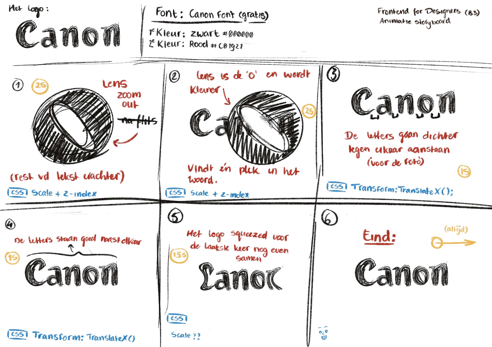

### Je ambitie:

Aan deze technieken/punten wil ik werken:

- Aan deze technieken/punten wil ik werken:
  - Meer CSS methodes die ik nog niet eerder heb gebruikt, zoals scale()
  - Mezelf uitdagen met selectoren (nth-of-type, etc)

</details>

## Opdracht 1 reflectie

<details open>
  <summary>uitwerken bij afronden opdracht (voor week 4)</summary>

### Je uitkomst - karakteristiek screenshot(s):

  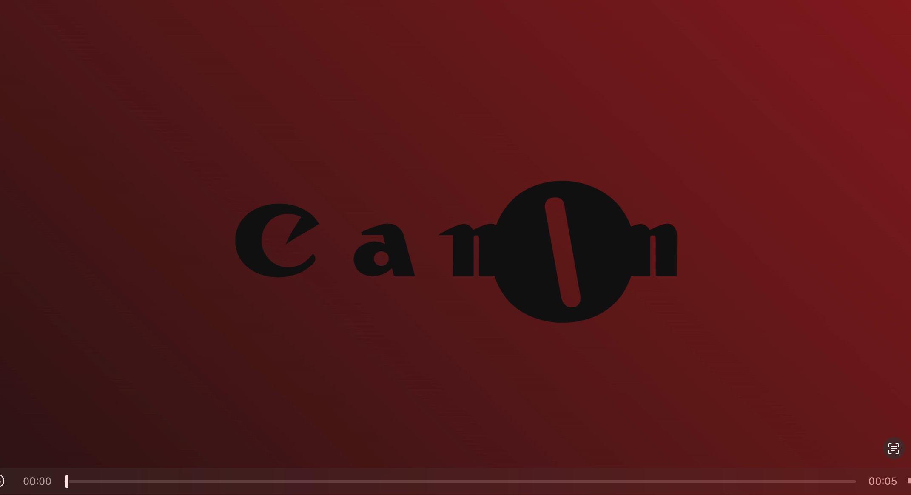

### Dit ging goed/Heb ik geleerd:

Korte omschrijving met plaatje(s)

De overgangen gingen heel goed en ik vond scale best latig te begrijpen, maar het is mij ook redelijk gelukt.

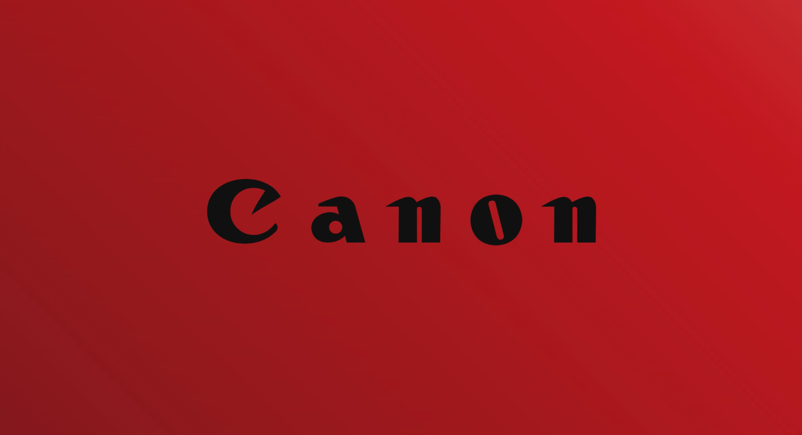
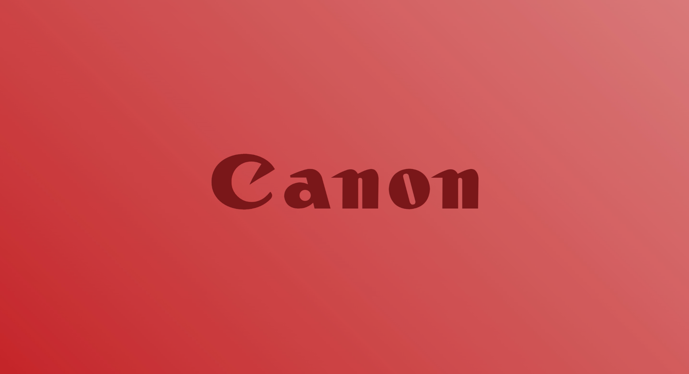
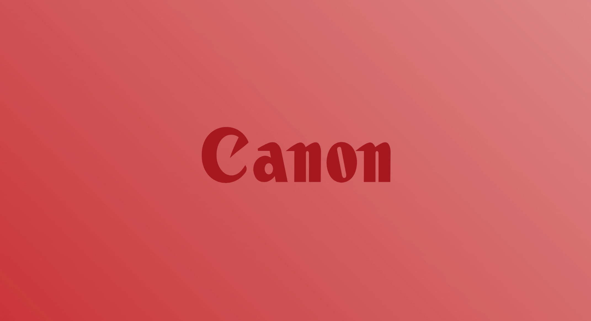


### Dit was lastig/Is niet gelukt:

Jammer genoeg is de lens shutter niet gelukt. Dit zou ik met een ::before en een ::after doen, maar omdat de O beweegt en roteert was dit niet te doen met mijn skillset en de tijd die ik had.

</details>

## Opdracht 2 plan

<details open>
  <summary>uitwerken na schetsen idee (voor week 5)</summary>

### Je ontwerp:

  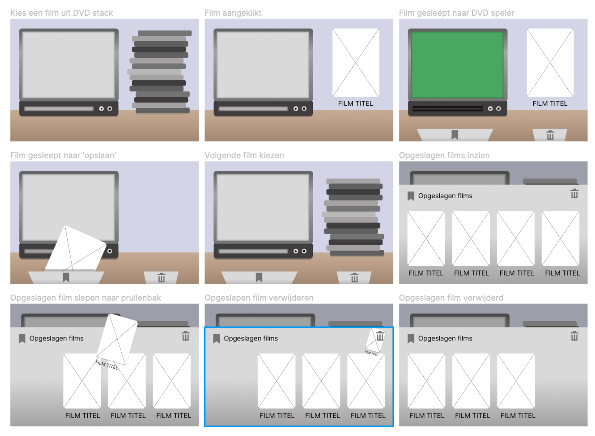

### Je ambitie:

Aan deze technieken/punten wil ik werken:

- Conditionals met CSS: plaatjes veranderen als er iets gebeurt, etc.
- Media queries: window size, dark mode (met :root)
- Responsiveness

</details>

## Opdracht 2 test

<details open>
  <summary>uitwerken na testen (week 7)</summary>

Neem minimaal 5 bevindingen op:

### Bevinding 1:

De responsiveness was goed gelukt, maar verpest nadat ik het filteren had toegevoegd. Dat bleek te komen omdat ik in mijn JavaScript een functie had die de gefilterde 'stapel' films op tafel plaatste, dus met flex-end:

```js
function filterList(event) {
	let deLijst = document.querySelector('body>section:nth-of-type(2)>ul');
	let nieuweFilter = event.target.value;
	deLijst.className = '';
	deLijst.classList.add(nieuweFilter);

	if (deLijst.className !== 'alles') {
		deLijst.style.justifyContent = 'flex-end';
		deLijst.style.position = 'absolute';
		deLijst.style.bottom = '12vh';
		form.style.zIndex = 10;
	}
}
```

Daardoor, als ik mijn scherm kleiner maakte en weer filterde, waren de films weer niet goed gepositioneerd, omdat ze ook hier de stijling bottom: 12vh; overnamen:

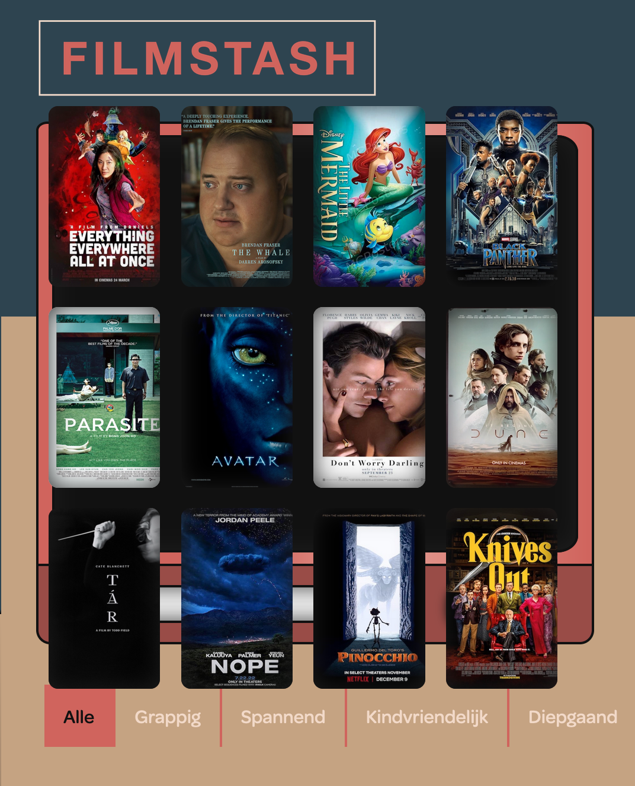

#### oplossing:

Dit heb ik kunnen oplossen door aan de if-statement toe te voegen dat dit alleen moet gebeuren als het scherm groter is dan 80em, net zoals in mijn CSS:

```js
function filterList(event) {
	let deLijst = document.querySelector('body>section:nth-of-type(2)>ul');
	let nieuweFilter = event.target.value;
	deLijst.className = '';
	deLijst.classList.add(nieuweFilter);

	if (
		deLijst.className !== 'alles' &&
		window.matchMedia('(min-width: 80em)').matches
	) {
		deLijst.style.justifyContent = 'flex-end';
		deLijst.style.position = 'absolute';
		deLijst.style.bottom = '12vh';
		form.style.zIndex = 10;
	}
}
```

Toen zag het er weer zo uit:

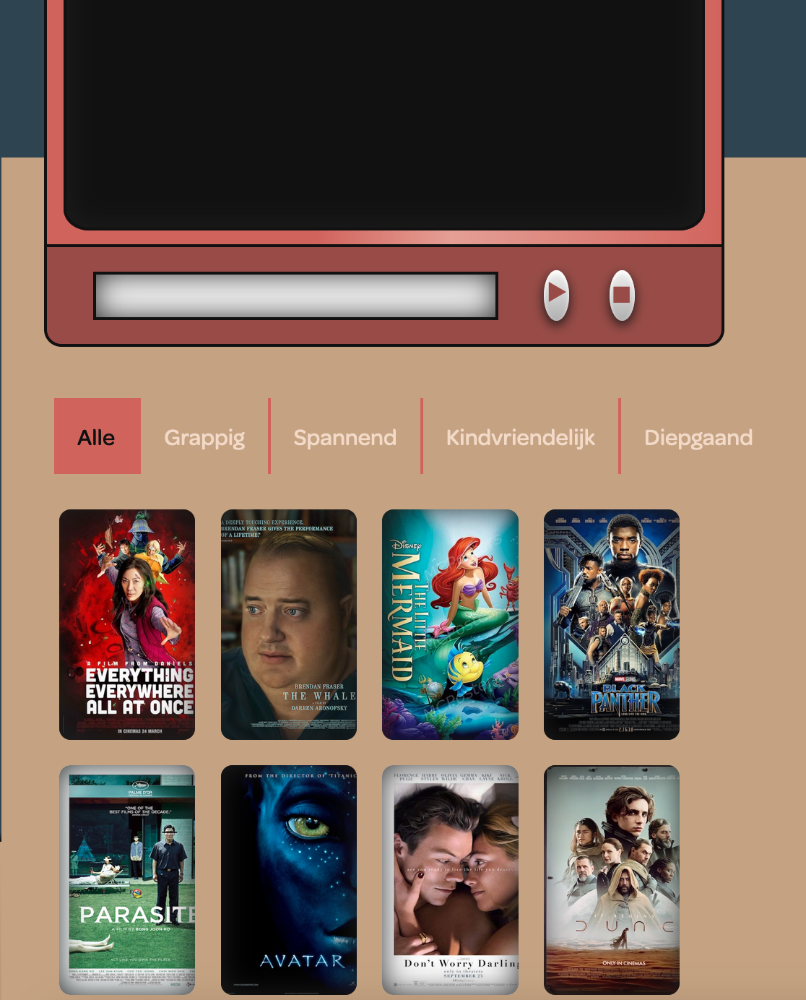

### Bevinding 2:

Het opslaan van alle films ging goed, totdat ik bij Avatar aankwam. Daar klikte ik op de knop, maar gebeurde er niks. Hetzelfde gold voor alle films die erna kwamen. Dat bleek na verdere inspectie te komen doordat ik een variabele naam niet had verandert:

```js
saveAvatar.addEventListener('click', (event) => {
	if (avatarOpgeslagen === false) {
		avatarSaved.classList.toggle('added');
		saveAvatar.textContent = 'Verwijder uit opgeslagen films';
		avatarOpgeslagen = true;
	} else {
		avatarSaved.classList.remove('added');
		saveAvatar.textContent = 'Sla deze film op';
		avatarOpgeslagen = false;
	}
});

saveAvatar.addEventListener('click', (event) => {
	avatarSaved.classList.remove('added');
	saveAvatar.textContent = 'Sla deze film op';
	avatarOpgeslagen = false;
});
```

#### oplossing:

Toen ik van de twee functie (event listener) de naam naar avatarRemove had verandert, en dus ook voor alle films erna [filmnaam]Remove had toegevoegd, ging het wel goed:

```js
saveAvatar.addEventListener('click', (event) => {
	if (avatarOpgeslagen === false) {
		avatarSaved.classList.toggle('added');
		saveAvatar.textContent = 'Verwijder uit opgeslagen films';
		avatarOpgeslagen = true;
	} else {
		avatarSaved.classList.remove('added');
		saveAvatar.textContent = 'Sla deze film op';
		avatarOpgeslagen = false;
	}
});

avatarRemove.addEventListener('click', (event) => {
	avatarSaved.classList.remove('added');
	saveAvatar.textContent = 'Sla deze film op';
	avatarOpgeslagen = false;
});
```

### Bevinding 3:

Als ik een film openhad op de televisie en ik sleepte er een andere film bij, dan kwamen ze naast elkaar te staan, terwijl ik wilde dat ze één voor één te zien werden. Dus als ik eentje opende maar er stond al een film open, dat die dan weer wegging. Maar dat leek niet gelukt te zijn.

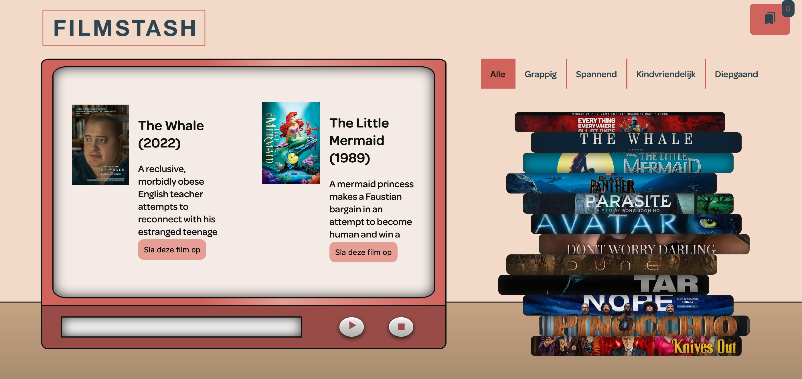

#### oplossing:

Ook hier bleek de oplossing in mijn JavaScript te zitten. Ik maakte eerst een functie closeOtherSections zodat bij de klik- en toetsenbord-interacties andere films sloten:

```js
function closeOtherSections(exceptSection) {
	const sections = document.querySelectorAll(
		'body > section:first-of-type > section:first-of-type > section:first-of-type > section'
	);
	sections.forEach((section) => {
		if (section !== exceptSection) {
			section.style.display = 'none';
		}
	});
}
```

En deed dit toen ook voor de drag-and-drop functie:

```js
document.getElementById('televisie').addEventListener('drop', function (event) {
	event.preventDefault();
	const data = event.dataTransfer.getData('text');
	const sectionId = data + '-section';
	const section = document.getElementById(sectionId);
	if (section) {
		section.style.display = 'flex';
		const sections = document.querySelectorAll(
			'body > section:first-of-type > section:first-of-type > section:first-of-type > section'
		);
		sections.forEach((sec) => {
			if (sec !== section) {
				sec.style.display = 'none';
			}
		});
	}
});
```

Daarna was het opgelost:

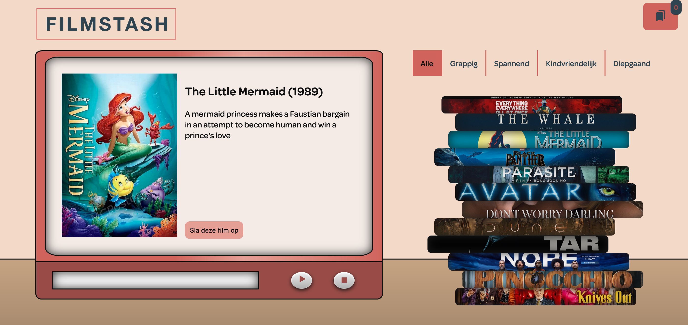

### Bevinding 4:

Ik had heel veel functies die zich elk moment konden updaten, en dan niet per sé slechts op de klik van een knop. Of niet per sé op de klik van één knop. In plaats daarvan moest er steeds gekeken worden of er een verandering was geweest, en zo ja, moest de functie worden uitgevoerd.

Een voorbeeld daarvan is het TV-scherm. Ik vond het leuk als het scherm 'uitging', en dus zwart werd, als er geen films werden laten zien, en dan aanging of wit werd als dat wel zo was. Maar het leek me echt heel veel werk om dat voor elke film in te bouwen, dus om bijvoorbeeld bij alle twaalf te zeggen: als er op de film geklikt wordt OF op hun keycode OF bij de drag and drop interactie moet het scherm wit worden. Want in dat geval zou ik voor twaalf films drie interacties moeten gebruiken als if-statements.

Voor nu was deze functie dus nog niet werkend.

#### oplossing:

Later bedacht ik me dat ik het veel makkelijker aan kon pakken. In plaats van te kijken naar een interactie, kijk ik naar de display van de sections (de film-informatie) in het scherm (die standaard 'uitstaan' met `display: none`). Als er eentje `display: flex` is, maakt niet uit welke, wordt het scherm wit.

Maar er moest uiteraard ook een listener zijn. De trigger van zo'n `display` naar `display: flex` is dus zo'n DVD, maar zoals ik al zei zijn er daar twaalf van.

Dus gebruik ik `setInterval`:

```js
function checkForFlexSections() {
	const screen = document.querySelector(
		'body > section:first-of-type > section:first-of-type > section:first-of-type'
	);
	const sections = screen.querySelectorAll('section');

	let displayFlexFound = false;

	sections.forEach((section) => {
		if (window.getComputedStyle(section).display === 'flex') {
			displayFlexFound = true;
			console.log('Echt een flex');
			return;
		} else {
			console.log('Geen flex hier');
		}
	});

	if (displayFlexFound) {
		screen.style.backgroundColor = 'var(--color-tvbackground)';
		screen.style.boxShadow =
			'rgba(255, 255, 255, 0.25) 0px 50px 100px -20px, rgba(0, 0, 0, 0.3) 0px 30px 60px -30px, rgba(10, 37, 64, 0.35) 0px -2px 6px 0px inset;';
	} else {
		screen.style.backgroundColor = 'var(--color-text)';
		screen.style.boxShadow = 'inset 0px 0px 20px rgba(31, 31, 31, 0.9);';
	}
}

setInterval(checkForFlexSections, 1000); // run elke seconde
```

Voor alle sections in het scherm kijk ik of er eentje is met displayFlex. Is dat wel zo, verandert de kleur van het scherm. En die hele functie runt iedere seconde, dus ongeacht de manier waarop een film wordt ingeladen, updatet het scherm mee.

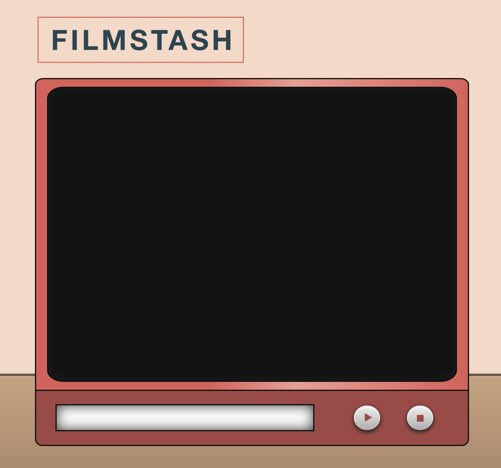
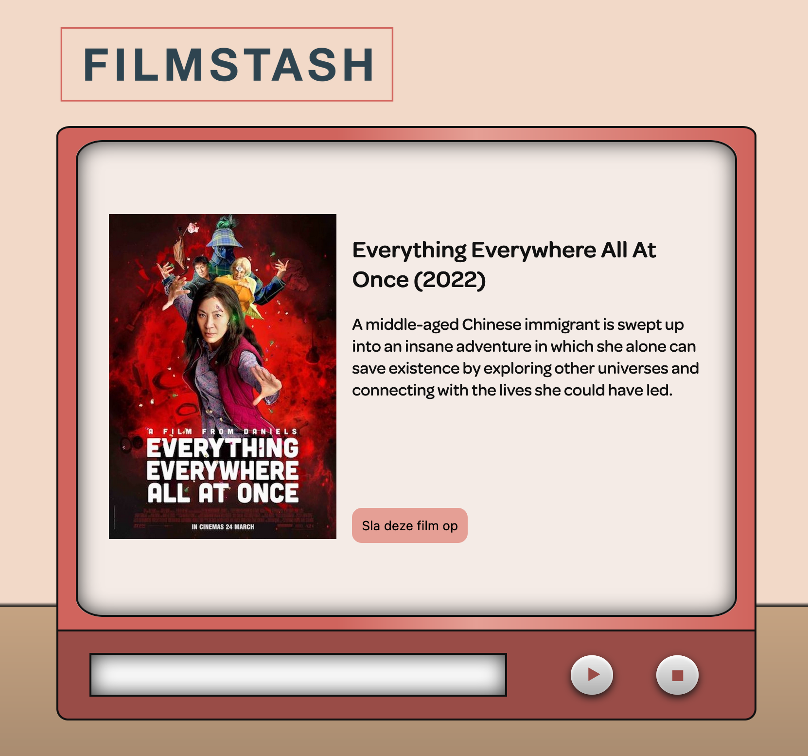

### Bevinding 5:

Ik gebruikte voor de favorietenlijst een teller en een section die je op kon roepen met een druk op de knop. Alleen als de gebruiker geen favorieten had, kreeg hij/zij ook geen feedback en bleef er alleen een soort rare strip over als de lijst tevoorschijn werd gehaald.

#### oplossing:

Ik heb nog een section toegevoegd die alleen wordt laten zien als de teller van favoriete films op 0 staat, met:

```js
function updateSavedCount() {
	const sections = document.querySelectorAll(
		'body > section:last-of-type > section.added'
	);
	const noMovies = document.querySelector(
		'body>section:last-of-type > section:first-of-type'
	);
	const savedCount = document.querySelector('body > button > span');

	if (sections.length > 0) {
		savedCount.textContent = sections.length;
		noMovies.style.display = 'none';
	} else {
		savedCount.textContent = 0;
		noMovies.style.display = 'inline';
	}
}

setInterval(updateSavedCount, 1000);
```

Nu ziet een lege favorietenlijst er zo uit:

 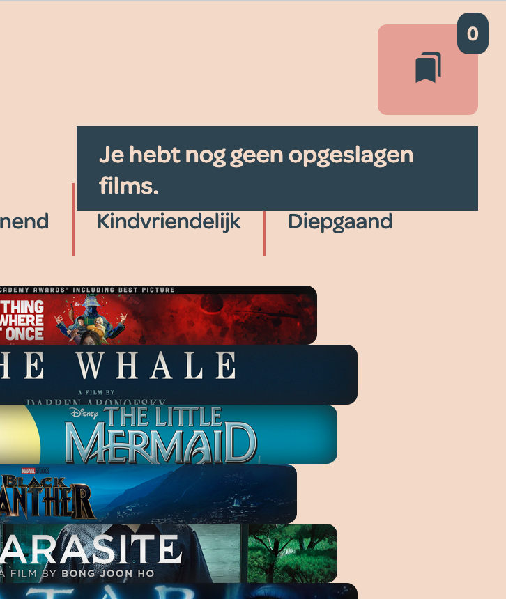

</details>

## Opdracht 2 reflectie

<details open>
  <summary>uitwerken bij afronden opdracht (voor week 8)</summary>

### Je uitkomst - karakteristiek screenshot(s):

  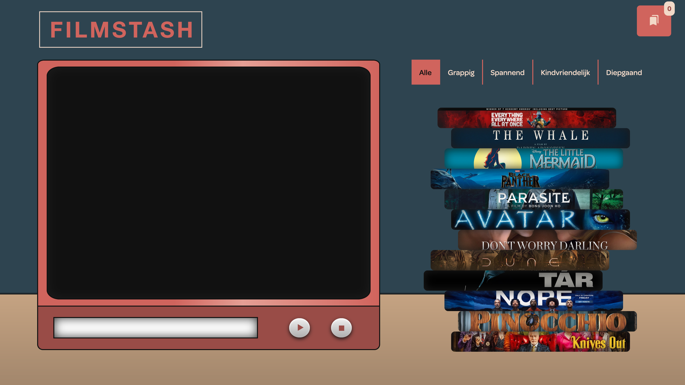

### Dit ging goed/Heb ik geleerd:

Ik heb veel geleerd over CSS en hoe je classes en IDs in kan zetten voor functies zoals filteren, waarvan ik eerst dacht dat het puur een CSS dingetje was. Ook drag and drop heb ik supersnel (voor mijn doen) kunnen regelen, al had ik wel heel veel JavaScript nodig om het dan ook nog 'netjes' te maken; één film tegelijk op het scherm, bijvoorbeeld. Daarom heb ik in mijn JS heel veel van hetzelfde, maar dan net iets anders voor de juiste films.

Op het TV-scherm zelf vind ik persoonlijk dat ik het nog iets mooier had kunnen maken, maar als ik denk aan de eindsprint die ik heb gemaakt en de dingen die mij zijn gelukt tegen mijn eigen verwachtingen in, ben ik vooral gewoon heel trots.

  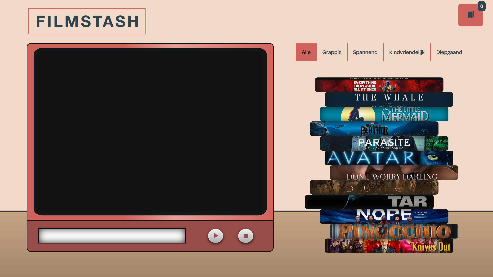
  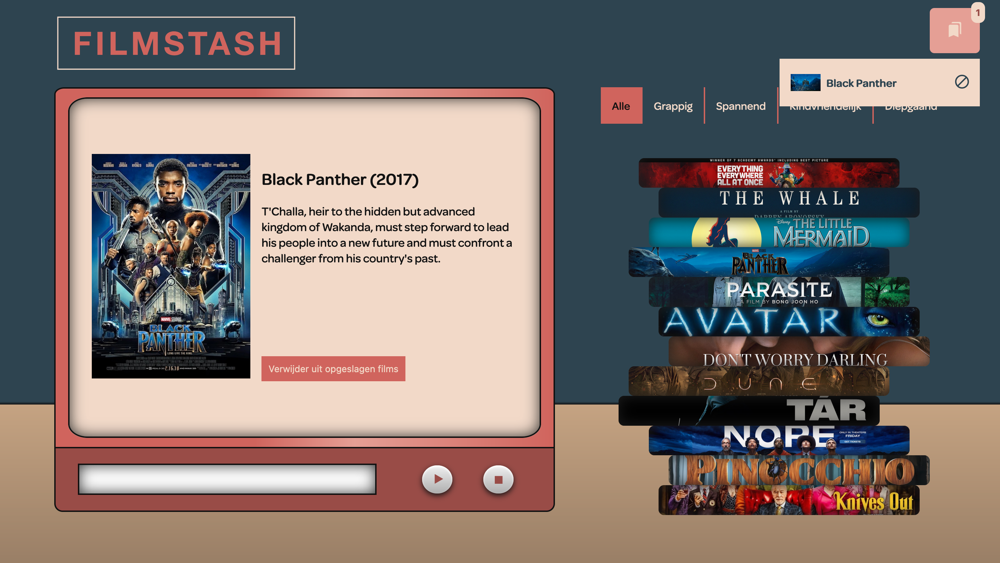
  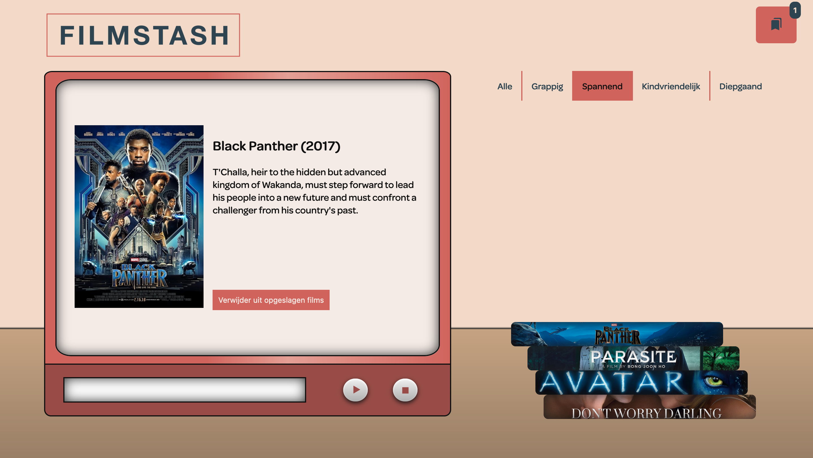

### Dit was lastig/Is niet gelukt:

Ik vond het heel lastig om cirkels responsive te maken. Op mijn televisie heb ik twee 'knoppen' die rond zijn. Ik dacht dat ik ze dezelfde hoogte en breedte kon geven, de `border-radius` 50% kon maken en dat ze dan responsive zouden zijn, maar helaas was dat niet het geval. Aan het einde had ik het eerlijk gezegd een beetje gehad, omdat ik het niet uit kon vogelen. Dat is jammer genoeg dus zo gebleven.

Verder ben ik zeker van mezelf onder de indruk!

</details>
